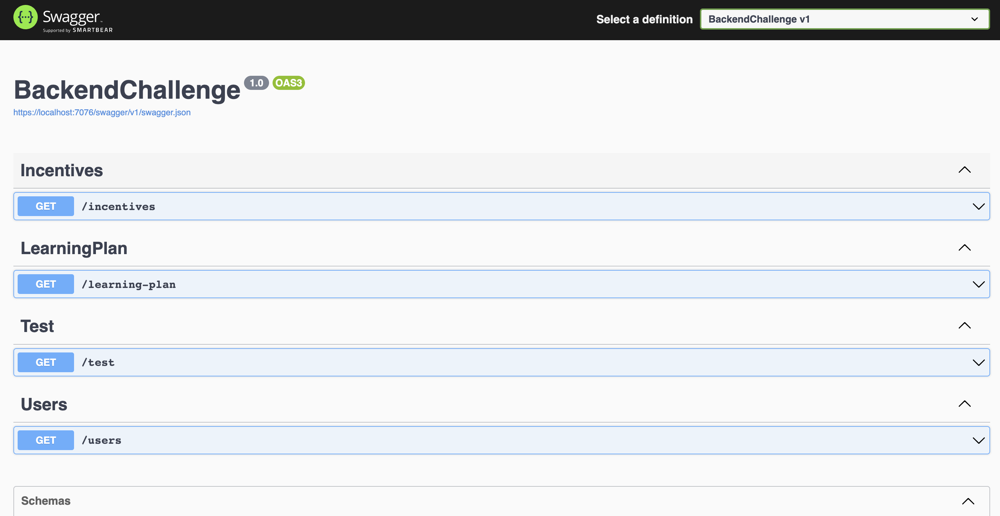

# Backend Challenge Starter
This is an API challenge project implemened 3 endpoints accepting requests and writing queries to extract data. There are 2 parts to the challenge: the [coding portion](#Coding-Portion) and the [written portion](#written-portion).

# Coding Portion

##  Running the project
_assumes you have .NET Core 6 installed_
1. Clone the project to your local 
```sh
git clone https://github.com/ElizaYang/BackendChallenge-main.git
```
2. Run the project
```sh
dotnet run
```
3. Verify it's working by navigating to this endpoint in your browser (you don't need to pass userToken in header).
It should display the text "working".
```
https://localhost:7076/test
```
4. :green_heart:Go to swagger to check endpoint details :green_heart:
```
https://localhost:7076/swagger/index.html
```

# Written Portion

## API Questions

* How many active users are there for UserToken = 1MEYQDDgwrTkYPtu7Vhfyjp7qkuGnf4ztR company?
    * 4
    ```json
    [
        {
            "userId": 1,
            "firstName": "Karalynn",
            "lastName": "Northcote"
        },
        {
            "userId": 2,
            "firstName": "Sean",
            "lastName": "Carter"
        },
        {
            "userId": 3,
            "firstName": "Fielding",
            "lastName": "Cabera"
        },
        {
            "userId": 4,
            "firstName": "Dan",
            "lastName": "Fawlkes"
        }
    ]
    ```
* What does the JSON of the user plan for UserToken = 1F7Xg1CJdffsnv9uEXj6GhLERQSam4xwx6 look like?
    ```json
    [
        {
            "userId": 2,
            "planItems": [
                {
                    "learningPlanItemId": 3,
                    "learningItemType": 0,
                    "learningItemName": "Managerial Economics",
                    "itemId": 4
                },
                {
                    "learningPlanItemId": 4,
                    "learningItemType": 0,
                    "learningItemName": "Design Thinking",
                    "itemId": 5
                },
                {
                    "learningPlanItemId": 5,
                    "learningItemType": 1,
                    "learningItemName": "Completion Bonus",
                    "itemId": 1
                }
            ]
        }
    ]
    ```
* How many incentives is UserToken = 1DeyjK5vvSwjc9o9jYArVo2yov2SnjnXEE eligible for?
    * 2
    ```json
    {
        "userId": 4,
        "eligibleIncentiveResponse": [
            {
                "incentiveId": 1,
                "incentiveName": "Completion Bonus",
                "serviceRequirement": 90,
                "roleEligibility": 0
            },
            {
                "incentiveId": 3,
                "incentiveName": "20% Time",
                "serviceRequirement": 90,
                "roleEligibility": 1
            }
        ]
    }
    ```
## Test Plan
The testing strategy for this API includes different types of tests to ensure the overall quality of the system. These include:

1. Unit Testing: User NUnit to ensure that individual functions or methods of the API work as intended.
2. Integration Testing: To ensure that the interaction between different parts of the API works correctly. Ex: sql connection...
3. Functional Testing: To ensure that the overall functionality of the API meets the requirements.
4. Performance Testing: To ensure that the API can handle a heavy load of requests while providing optimal performance. Using a simulator to generate loads...

Below, I will focus on the **functional tests** and I will cover the following aspects:
1. Input Validation: Testing of various types of input to ensure that they are validated correctly, and appropriate error messages are returned.
2. Response Formatting and Error Messages: Testing of response formatting and error messages to ensure that they are displayed correctly.
3. API Endpoints: Testing of API endpoints to ensure that they function correctly under various conditions.
4. Authentication and Authorization: Testing of authentication and authorization to ensure that only authorized users have access to the API.
5. Database Connectivity: Testing of database connectivity and queries to ensure that data is being retrieved and updated correctly.

Note that testing of database connectivity may require a separate testing database or mock database context to return specific values for testing purposes.

### Test Cases 

### Get users API Endpoint
```
/users
```
1. Test case: Valid request returns 200 OK response and user data

    * Preconditions:
        * There are active users for the company of the querying user in the database
        * A valid user token is passed in the request header
    * Test steps:
        - [ ] Send a GET request to the users endpoint with a valid user token in the request header
        - [ ] Verify that the response status code is 200 OK
        - [ ] Verify that the response body contains an array of UserResponses including userId, firstName, and lastName
        - [ ] Verify that the user data in the response matches the user data in the database

2. Test case: Unauthorized request returns 401 Unauthorized response

    * Preconditions:
        * A user token is not passed in the request header or is empty/null
        * Test steps:
        - [ ] Send a GET request to the users endpoint without a user token in the request header
        - [ ] Verify that the response status code is 401 Unauthorized

3. Test case: Nonexistent user token returns 404 Not Found response

    * Preconditions:
        * A user token passed in the request header does not match any user token in the database
    * Test steps:
    - [ ] Send a GET request to the users endpoint with a nonexistent user token in the request header
    - [ ] Verify that the response status code is 404 Not Found

4. Test case: Cancelled request returns 500 Internal Server Error response

    * Preconditions:
        * The request is cancelled before completing the database query
    * Test steps:
        - [ ] Send a GET request to the users endpoint with a valid user token in the request header and a - [ ] cancellation token
        - [ ] Cancel the request before the database query completes
        - [ ] Verify that the response status code is 500 Internal Server Error

### Get learning-plan API Endpoint
```
/learning-plan
```
1. Test case: Valid request returns 200 OK response and learning plan data

    * Preconditions:
        * There are learning plans with related items, courses, and incentives in the database for the company of the querying user
        * A valid user token is passed in the request header
    * Test steps:
        - [ ] Send a GET request to the learning plan endpoint with a valid user token in the request header
        - [ ] Verify that the response status code is 200 OK
        - [ ] Verify that the response body contains an array of LearningPlanResponses including UserId and an array of PlanItemResponses, each containing LearningPlanItemId, LearningItemType, LearningItemName, and ItemId
        - [ ] Verify that the learning plan data in the response matches the learning plan data in the database

2. Test case: Unauthorized request returns 401 Unauthorized response
    * Same as get users endpoint test case 2.

3. Test case: Nonexistent user token returns 404 Not Found response
    * Same as get users endpoint test case 3.

4. Test case: Empty learning plan returns 200 OK response and empty array

    * Preconditions:
        * There are no learning plans with related items, courses, and incentives for the company of the querying user in the database
    * Test steps:
    - [ ] Send a GET request to the learning plan endpoint with a valid user token in the request header
    - [ ] Verify that the response status code is 200 OK
    - [ ] Verify that the response body contains an empty array of LearningPlanResponses

5. Test case: Cancelled request returns 500 Internal Server Error response
    * Same as get users endpoint test case 4.

### Get incentives API Endpoint
```
/incentives
```
1. Test case: Valid request returns 200 OK response and correct incentives data

    * Preconditions:
        * There are incentives with related items, roles, and incentives in the database for the company of the querying user
        * A valid user token is passed in the request header
    * Test steps:
        - [ ] Send a GET request to the incentives endpoint with a valid user token in the request header
        - [ ] Verify that the response status code is 200 OK
        - [ ] Verify that the response body contains an array of IncentiveResponses including UserId and an array of EligibleIncentiveResponse, each containing IncentiveId, IncentiveName, ServiceRequirement, and roleEligibility
        - [ ] Verify that the incentives data in the response matches the eligible incentives data in the database

2. Test case: Unauthorized request returns 401 Unauthorized response
    * Same as get users endpoint test case 2.

3. Test case: Nonexistent user token returns 404 Not Found response
    * Same as get users endpoint test case 3.

4. Test case: Empty incentives returns 200 OK response and empty array

    * Preconditions:
        * There are no incentive with related user, role and service requirement for the company of the querying user in the database
    * Test steps:
    - [ ] Send a GET request to the incentive endpoint with a valid user token in the request header
    - [ ] Verify that the response status code is 200 OK
    - [ ] Verify that the response body contains an empty array of IncentiveResponses

5. Test case: Cancelled request returns 500 Internal Server Error response
    * Same as get users endpoint test case 4.
